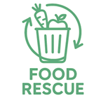

# 🍽️ Food Rescue App



**Reduce food waste. Save money. Enjoy great meals.**  
A mobile app built with **React Native & Expo** connecting users with restaurants & stores offering discounted surplus food.


---

## 🚀 Overview

The application provides a complete user journey, starting from authentication and onboarding to browsing food offers, managing orders, earning rewards, and customizing user settings.

The project follows a clean, scalable architecture suitable for real-world production applications.

---

## ✨ Features

### 🔐 Authentication

- Login
- Register
- Log in with Face ID
- Forgot Password
- OTP Verification
- Reset Password

### 📱 Main Application

- Explore food offers
- Favorites
- Orders history
- Earn rewards
- User profile and settings

### ⚙️ Settings

- Profile management
- Saved addresses
- Payment methods
- Receipts
- Country & Language
- Theme (Light / Dark)

---

### 🔑 Authentication Flow


---

<details>
<summary>🧭 Navigation Structure</summary>
```
RootNavigator
├── AuthStack
│    ├── Login
│    ├── Register
│    ├── ForgotPassword
│    ├── OTPScreen
│    └── ResetPassword
│
├── ClientStack
│    ├── Explore
│    ├── Favorites
│    ├── Orders
│    ├── Earn
│    └── SettingsStack
│         ├── SettingsMain      // Client only
│         ├── Receipts          // Client only
│         ├── SavedAddresses    // Client only
│         ├── PaymentMethod     // Client only
│         ├── Country           // Client only
│         ├── Profile           // Shared
│         ├── Theme             // Shared
│         └── Language          // Shared
│
└── MerchantStack
     ├── Orders
     ├── Products
     ├── Analytics
     └── SettingsStack
          ├── Profile           // Shared
          ├── Theme             // Shared
          └── Language          // Shared

```
</details>

### 🧭 Project Structure
<details>
```

food-rescue
├─ .env
├─ android
│ ├─ app
│ │ ├─ build.gradle
│ │ ├─ proguard-rules.pro
│ │ └─ src
│ │ ├─ debug
│ │ │ └─ AndroidManifest.xml
│ │ ├─ debugOptimized
│ │ │ └─ AndroidManifest.xml
│ │ └─ main
│ │ ├─ AndroidManifest.xml
│ │ ├─ java
│ │ │ └─ com
│ │ │ └─ muhannadbadawi
│ │ │ └─ FoodRescue
│ │ │ ├─ MainActivity.kt
│ │ │ └─ MainApplication.kt
│ │ └─ res
│ │ ├─ drawable
│ │ │ ├─ ic_launcher_background.xml
│ │ │ └─ rn_edit_text_material.xml
│ │ ├─ drawable-hdpi
│ │ │ └─ splashscreen_logo.png
│ │ ├─ drawable-mdpi
│ │ │ └─ splashscreen_logo.png
│ │ ├─ drawable-xhdpi
│ │ │ └─ splashscreen_logo.png
│ │ ├─ drawable-xxhdpi
│ │ │ └─ splashscreen_logo.png
│ │ ├─ drawable-xxxhdpi
│ │ │ └─ splashscreen_logo.png
│ │ ├─ mipmap-anydpi-v26
│ │ │ ├─ ic_launcher.xml
│ │ │ └─ ic_launcher_round.xml
│ │ ├─ mipmap-hdpi
│ │ │ ├─ ic_launcher.webp
│ │ │ ├─ ic_launcher_foreground.webp
│ │ │ └─ ic_launcher_round.webp
│ │ ├─ mipmap-mdpi
│ │ │ ├─ ic_launcher.webp
│ │ │ ├─ ic_launcher_foreground.webp
│ │ │ └─ ic_launcher_round.webp
│ │ ├─ mipmap-xhdpi
│ │ │ ├─ ic_launcher.webp
│ │ │ ├─ ic_launcher_foreground.webp
│ │ │ └─ ic_launcher_round.webp
│ │ ├─ mipmap-xxhdpi
│ │ │ ├─ ic_launcher.webp
│ │ │ ├─ ic_launcher_foreground.webp
│ │ │ └─ ic_launcher_round.webp
│ │ ├─ mipmap-xxxhdpi
│ │ │ ├─ ic_launcher.webp
│ │ │ ├─ ic_launcher_foreground.webp
│ │ │ └─ ic_launcher_round.webp
│ │ ├─ values
│ │ │ ├─ colors.xml
│ │ │ ├─ strings.xml
│ │ │ └─ styles.xml
│ │ └─ values-night
│ │ └─ colors.xml
│ ├─ build.gradle
│ ├─ gradle
│ │ └─ wrapper
│ │ ├─ gradle-wrapper.jar
│ │ └─ gradle-wrapper.properties
│ ├─ gradle.properties
│ ├─ gradlew
│ ├─ gradlew.bat
│ └─ settings.gradle
├─ app.json
├─ App.tsx
├─ babel.config.js
├─ config.ts
├─ eas.json
├─ package.json
├─ plop-templates
│ ├─ component.styles.ts.hbs
│ ├─ component.tsx.hbs
│ └─ screen.tsx.hbs
├─ plopfile.js
├─ README.md
├─ src
│ ├─ api
│ │ ├─ api-client.ts
│ │ ├─ auth-service.ts
│ │ └─ user-service.ts
│ ├─ assets
│ │ ├─ Authentication Flow.png
│ │ ├─ cards
│ │ │ ├─ ApplePay.jpg
│ │ │ ├─ CliQ.png
│ │ │ ├─ Mastercard.jpg
│ │ │ ├─ PayPal.jpg
│ │ │ └─ Visa.jpg
│ │ ├─ ChickenBurger.jpg
│ │ ├─ FoodRescueLogo.png
│ │ ├─ GreekSalad.jpg
│ │ ├─ PizzaMargherita.jpg
│ │ ├─ supermarket.png
│ │ ├─ supermarket2.png
│ │ └─ supermarket3.png
│ ├─ constants
│ │ ├─ Colors.ts
│ │ ├─ Fonts.ts
│ │ ├─ mockData.ts
│ │ └─ types.ts
│ ├─ localization
│ │ ├─ ar.json
│ │ ├─ en.json
│ │ └─ i18n.ts
│ ├─ navigation
│ │ ├─ root-navigator.tsx
│ │ ├─ screens-type
│ │ │ ├─ auth-screens.ts
│ │ │ └─ setting-screens.ts
│ │ └─ stacks
│ │ ├─ auth-stack.tsx
│ │ ├─ client-stack.tsx
│ │ └─ merchant-stack.tsx
│ ├─ screens
│ │ ├─ app
│ │ │ ├─ client
│ │ │ │ ├─ earn
│ │ │ │ │ ├─ earn.styles.ts
│ │ │ │ │ └─ earn.tsx
│ │ │ │ ├─ explore
│ │ │ │ │ ├─ explore.styles.ts
│ │ │ │ │ └─ explore.tsx
│ │ │ │ ├─ favorites
│ │ │ │ │ ├─ favorites.styles.ts
│ │ │ │ │ └─ favorites.tsx
│ │ │ │ └─ orders
│ │ │ │ ├─ orders.styles.ts
│ │ │ │ └─ orders.tsx
│ │ │ ├─ merchant
│ │ │ └─ shared
│ │ │ ├─ components
│ │ │ │ ├─ avatar
│ │ │ │ │ ├─ avatar.styles.ts
│ │ │ │ │ └─ avatar.tsx
│ │ │ │ ├─ bottom-sheet
│ │ │ │ │ ├─ bottom-sheet.styles.ts
│ │ │ │ │ └─ bottom-sheet.tsx
│ │ │ │ ├─ button
│ │ │ │ │ ├─ button.styles.ts
│ │ │ │ │ └─ button.tsx
│ │ │ │ ├─ chip
│ │ │ │ │ ├─ chip.styles.ts
│ │ │ │ │ └─ chip.tsx
│ │ │ │ ├─ empty
│ │ │ │ │ ├─ empty.styles.ts
│ │ │ │ │ └─ empty.tsx
│ │ │ │ ├─ password
│ │ │ │ │ ├─ password.styles.ts
│ │ │ │ │ └─ password.tsx
│ │ │ │ ├─ screen
│ │ │ │ │ ├─ screen.styles.ts
│ │ │ │ │ └─ screen.tsx
│ │ │ │ └─ text
│ │ │ └─ screens
│ │ │ └─ settings
│ │ │ ├─ client-settings-stack.tsx
│ │ │ ├─ country
│ │ │ │ ├─ country.styles.ts
│ │ │ │ └─ country.tsx
│ │ │ ├─ language-screen
│ │ │ │ ├─ language-screen.styles.ts
│ │ │ │ └─ language-screen.tsx
│ │ │ ├─ merchant-settings-stack.tsx
│ │ │ ├─ payment-method
│ │ │ │ ├─ payment-method.styles.ts
│ │ │ │ └─ payment-method.tsx
│ │ │ ├─ profile
│ │ │ │ ├─ profile.styles.ts
│ │ │ │ └─ profile.tsx
│ │ │ ├─ receipts
│ │ │ │ ├─ receipts.styles.ts
│ │ │ │ └─ receipts.tsx
│ │ │ ├─ saved-addresses
│ │ │ │ ├─ details
│ │ │ │ │ ├─ address-type
│ │ │ │ │ │ ├─ address-type.styles.ts
│ │ │ │ │ │ └─ address-type.tsx
│ │ │ │ │ ├─ details.styles.ts
│ │ │ │ │ └─ details.tsx
│ │ │ │ ├─ saved-addresses.styles.ts
│ │ │ │ └─ saved-addresses.tsx
│ │ │ ├─ settings-main
│ │ │ │ ├─ settings.styles.ts
│ │ │ │ └─ settings.tsx
│ │ │ ├─ settings-navigator.tsx
│ │ │ ├─ settings-stack-param.ts
│ │ │ └─ theme-screen
│ │ │ ├─ theme-screen.styles.ts
│ │ │ └─ theme-screen.tsx
│ │ └─ auth
│ │ ├─ auth-context.tsx
│ │ ├─ forgot-password
│ │ │ ├─ forgot-password.styles.ts
│ │ │ └─ forgot-password.tsx
│ │ ├─ login
│ │ │ ├─ login.styles.ts
│ │ │ └─ login.tsx
│ │ ├─ otp
│ │ │ ├─ otp.styles.ts
│ │ │ └─ otp.tsx
│ │ ├─ register
│ │ │ ├─ fields
│ │ │ │ └─ shop-owner-fields
│ │ │ │ ├─ fields.styles.ts
│ │ │ │ └─ shop-owner-fields.tsx
│ │ │ ├─ register.styles.ts
│ │ │ └─ register.tsx
│ │ └─ reset-password
│ │ ├─ reset-password.styles.ts
│ │ └─ reset-password.tsx
│ ├─ stores
│ │ └─ useStoreLocations.ts
│ └─ theme
│ └─ theme-context.tsx
└─ tsconfig.json

````
</details>

---

## 🛠️ Setup & Run

```bash
# Clone repository
git clone https://github.com/username/food-rescue.git
cd food-rescue

# Install dependencies
npm install

# Start Expo
npm run start

````
